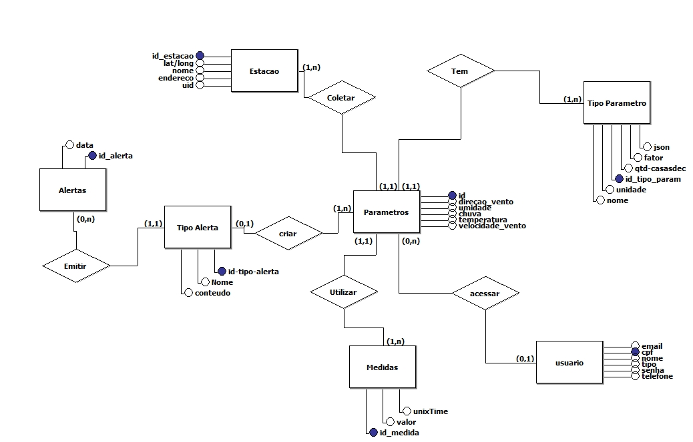
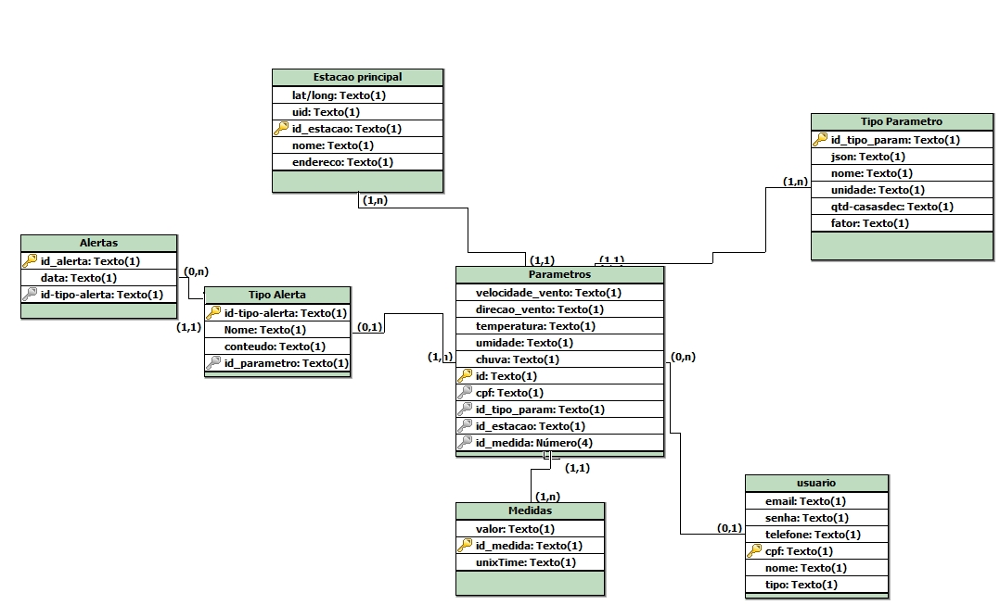

# Software de Processamento de Dados de Estações Meteorológicas

A Tecsus é uma startup que trabalha com coleta e processamento de dados através de redes de sensores sem fio, conhecidos como Internet das Coisas (IoT), na área de utilidades (água, energia e gás). Com o intuito de expandir seu portfólio para o monitoramento ambiental, a empresa optou pelo desenvolvimento de estações meteorológicas de baixo custo. Essas estações serão equipadas com sensores para medir direção e velocidade do vento, índice pluviométrico, umidade, temperatura e pressão atmosférica. Os dados coletados serão enviados periodicamente para um servidor e processados para serem exibidos em um portal, fornecendo relatórios e dashboards. O portal, além de informar as condições meteorológicas, irá destacar a importância do monitoramento ambiental na prevenção de desastres naturais através da geração de alertas. Com o intuito de de envolver alunos do ensino médio será exibido informações de como funciona os sensores.

## Sprints
| Sprint | Período | Status |
| :----: | :-----: | :----: |
| [Sprint 1]| 10/03/2025 - 30/03/2025 | ✅ |   
| [Sprint 2]| 07/04/2025 - 27/04/2025 | ❌ |  
| [Sprint 3]| 05/05/2025 - 25/05/2025 | ❌ |  

# Backlog
| Sprint | User Stories                                                                                                                                           | Estimativa |
|--------|--------------------------------------------------------------------------------------------------------------------------------------------------------|------------|
| 1      | Como admin, quero poder cadastrar estação e visualizar estações cadastradas e poder fazer alterações nesta(s)                     | 5          |
| 1      | como usuario, quero poder visualizar estações cadastradas e obter mais informações sobre a(s) mesma(s).                           | 5          |
| 1      | como usuario, quero poder fazer login para ter minhas informações salvas.                                                         | 3          |
| 1      | como admin, quero poder fazer login para poder ter acesso a area destinada a mim.                                                 | 3          |
| 1      | Como usuario e admin, quero poder visualizar alertas metereologicos em determinado periodo.                                               | 6          |
| 1      | Como usuario e admin, quero poder visualizar parametros de uma estação.                                               | 6          |

## Equipe
| Foto | Nome | Função | Github | LinkedIn |
| :--: | :----: | :--: | :----: | :------: |
|  | Claudio Jayme Diniz | Product Owner |  |  |
|  | Henrique de Godoy Ramos | Scrum Master |  |  |
|  | Ivan Suiyama Silva | DEV Team |  |  |
|  | Arthur Karnas da Rocha | DEV Team |  |  |
|   | José Eduardo Fernandes | DEV Team |  |  |

## Diagramas do Banco de Dados
### Diagrama Entidade-Relacionamento

### Diagrama Lógico

# Endpoints do backend

#### Endpoints de Usuário
| Método | URL | Body (JSON) |
|:------:|:---:|:-----------:|
| POST   | http://localhost:3000/api/usuarios | `{ "cpf": "50145499855", "email": "usuario1@email.com", "telefone": "11987654321", "senha": "senha123", "nome": "João Silva", "tipo": 1 }` |
| GET    | http://localhost:3000/api/usuarios | - |
| GET    | http://localhost:3000/api/usuarios/{id} | - |
| PUT    | http://localhost:3000/api/usuarios/{id} | `{ "cpf": "50145499855", "email": "usuario2@email.com", "telefone": "11987654321", "senha": "senha123", "nome": "João Silva atualizado", "tipo": 2 }` |
| DELETE | http://localhost:3000/api/usuarios/{id} | - |

#### Endpoints de Estação
| Método | URL | Body (JSON) |
|:------:|:---:|:-----------:|
| POST   | http://localhost:3000/api/estacao | `{ "uid": 1, "nome": "Estação Central", "endereco": "Rua das Flores, 123", "latitude": -23.55052, "longitude": -46.633308, "data_instalacao": "2024-01-10", "status": true }` |
| GET    | http://localhost:3000/api/estacoes | - |
| GET    | http://localhost:3000/api/estacoes/{nome} | - |
| PUT    | http://localhost:3000/api/estacao/{id} | `{ "uid": 2, "nome": "Estação Sul", "endereco": "Rua das Flores, 321", "latitude": -23.55052, "longitude": -46.633308, "data_instalacao": "2024-01-10", "status": true }` |
| DELETE | http://localhost:3000/api/estacoes/{id} | - |

#### Endpoints de Medidas
| Método | URL | Body (JSON) |
|:------:|:---:|:-----------:|
| POST   | http://localhost:3000/api/medidas | `{ "valor": 25.6, "unix_time": "1715554321" }` |
| GET    | http://localhost:3000/api/medidas | - |
| GET    | http://localhost:3000/api/medidas/{id} | - |
| PUT    | http://localhost:3000/api/medidas/{id} | `{ "valor": 26.58, "unix_time": "123454321" }` |
| DELETE | http://localhost:3000/api/medidas/{id} | - |

#### Endpoints de Tipo de Parâmetros
| Método | URL | Body (JSON) |
|:------:|:---:|:-----------:|
| POST   | http://localhost:3000/api/tipoparametro | `{ "json_param": "{\"limite\": 50, \"alerta\": true}", "nome": "Temperatura", "unidade": "°C", "qtd_casadesc": "2", "fator": "1.0" }` |
| GET    | http://localhost:3000/api/tipoparametro | - |
| GET    | http://localhost:3000/api/tipoparametro/{id} | - |
| PUT    | http://localhost:3000/api/tipoparametro/{id} | `{ "json_param": "{\"limite\": 50, \"alerta\": true}", "nome": "Temperatura2", "unidade": "°C", "qtd_casadesc": "3", "fator": "3.0" }` |
| DELETE | http://localhost:3000/api/tipoparametro/{id} | - |

#### Endpoints de Parâmetros
| Método | URL | Body (JSON) |
|:------:|:---:|:-----------:|
| POST   | http://localhost:3000/api/parametro | `{ "velocidade_vento": 12.5, "direcao_vento": 270, "temperatura": 30.2, "umidade": 60, "chuva": 5.1, "cpf_usuario": "50145499855", "tipo_parametro": 1, "id_da_estacao": 1, "id_de_medida": 1 }` |
| GET    | http://localhost:3000/api/parametro | - |
| GET    | http://localhost:3000/api/parametro/{id} | - |
| PUT    | http://localhost:3000/api/parametro/{id} | `{ "velocidade_vento": 12.5, "direcao_vento": 270, "temperatura": 26.2, "umidade": 80, "chuva": 5.1, "cpf_usuario": "50145499855", "tipo_parametro": 1, "id_da_estacao": 2, "id_de_medida": 3 }` |
| DELETE | http://localhost:3000/api/parametro/{id} | - |

#### Endpoints de Tipo de Alerta
| Método | URL | Body (JSON) |
|:------:|:---:|:-----------:|
| POST   | http://localhost:3000/api/tipoalerta | `{ "nome": "Alerta de Temperatura", "conteudo": "Temperatura acima de 40°C", "parametro": { "id": 1 } }` |
| GET    | http://localhost:3000/api/tipoalerta | - |
| GET    | http://localhost:3000/api/tipoalerta/{id} | - |
| PUT    | http://localhost:3000/api/tipoalerta/{id} | `{ "nome": "Alerta de Temperatura2", "conteudo": "Temperatura acima de 50°C", "parametro": { "id": 1 } }` |
| DELETE | http://localhost:3000/api/tipoalerta/{id} | - |

#### Endpoints de Alerta
| Método | URL | Body (JSON) |
|:------:|:---:|:-----------:|
| POST   | http://localhost:3000/api/alerta | `{ "data_alerta": "2025-03-25", "tipoAlerta": { "id_tipo_alerta": 1 } }` |
| GET    | http://localhost:3000/api/alerta | - |
| GET    | http://localhost:3000/api/alerta/{id} | - |
| PUT    | http://localhost:3000/api/alerta/{id} | `{ "data_alerta": "2025-07-25", "tipoAlerta": { "id_tipo_alerta": 2 } }` |
| DELETE | http://localhost:3000/api/alerta/{id} | - |

## Endpoints do frontend

#### Endpoints de Usuário
| Método | URL |
|:------:|:---:|
| POST   | http://localhost:5173/cadastrousuario |
| GET    | http://localhost:5173/usuarios |
| PUT    | http://localhost:5173/editarusuario/:cpfEdicao |

#### Endpoints de Estação
| Método | URL |
|:------:|:---:|
| POST   | http://localhost:5173/cadastroestacao |
| GET    | http://localhost:5173/estacoes |
| PUT    | http://localhost:5173/editarestacao/:idEdicao |

#### Endpoints de Medidas
| Método | URL |
|:------:|:---:|
| POST   | http://localhost:5173/cadastromedidas |
| GET    | http://localhost:5173/medidas |
| PUT    | http://localhost:5173/editarmedida/:idEdicao |

#### Endpoints de Tipo de Parâmetro
| Método | URL |
|:------:|:---:|
| POST   | http://localhost:5173/cadastrotipoparametro |
| GET    | http://localhost:5173/tipoparametro |
| PUT    | http://localhost:5173/editartipoparametro/:idEdicao |

#### Endpoints de Parâmetros
| Método | URL |
|:------:|:---:|
| POST   | http://localhost:5173/cadastroparametro |
| GET    | http://localhost:5173/parametros |
| PUT    | http://localhost:5173/editarparametro/:id |

#### Endpoints de Tipo de Alerta
| Método | URL |
|:------:|:---:|
| POST   | http://localhost:5173/cadastrotipoalerta |
| GET    | http://localhost:5173/tipoalertas |
| PUT    | http://localhost:5173/editartipoalerta/:id |

#### Endpoints de Alertas
| Método | URL |
|:------:|:---:|
| POST   | http://localhost:5173/cadastroalerta |
| GET    | http://localhost:5173/alertas |
| PUT    | http://localhost:5173/editaralerta/:id |

